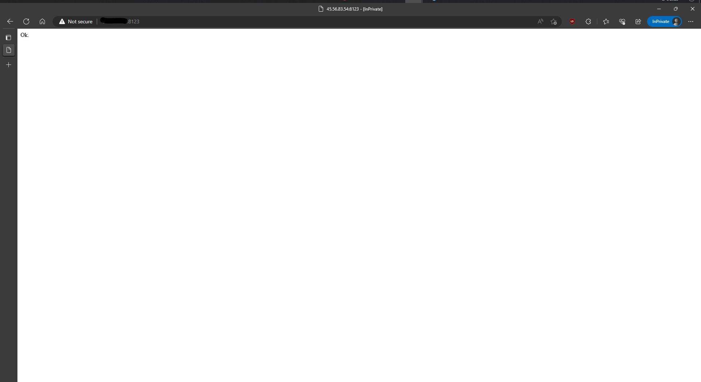

# vf-langchain-api-automation
automation script

# Steps to run the script
1. Install `wget`
```
sudo apt update && sudo apt install wget
```
2. Now run this command
```
wget https://raw.githubusercontent.com/sc0rp10n-py/vf-langchain-api-automation/main/run.sh
```
3. Now do this
```
sudo chmod +x run.sh
```
4. Now run the script using this
```
./run.sh
```

# Other steps

You can verify the running docker instances with this
```
sudo docker ps
```

For other commands you can refer the [official docs](https://docs.docker.com/)

# Screenshots


